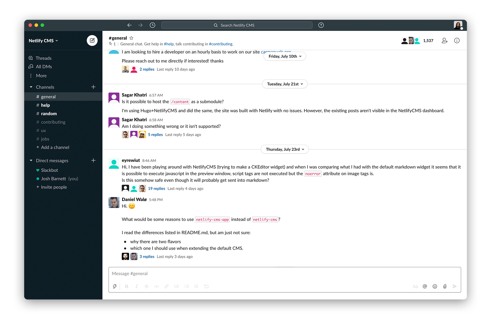

# Netlify Theme

> A Netlify-inspired dark theme for [Hyper](https://hyper.is/), [Slack](https://slack.com), [VS Code](https://code.visualstudio.com/), [Zsh](https://www.zsh.org/) and many more.

## Color Palette

| Palette      | Hex       | RGB           | HSL             |
| ------------ | --------- | ------------- | --------------- |
| Background   | `#0e1e25` | `14 30 37`    | `196° 45% 10%`  |
| Foreground   | `#f7f8f8` | `247 248 248` | `180° 7% 97%`   |
| Current Line | `#2d3b41` | `45 59 65`    | `198° 18% 22%`  |
| Selection    | `#2d3b41` | `45 59 65`    | `198° 18% 22%`  |
| Comment      | `#15847d` | `21 132 125`  | `176° 73% 30%`  |
| Red          | `#e8114e` | `232 17 78`   | `343° 86% 49%`  |
| Orange       | `#f86816` | `248 104 22`  | `22° 94% 53%`   |
| Yellow       | `#ffad43` | `255 173 67`  | `34° 100% 63%`  |
| Green        | `#43d860` | `67 216 96`   | `132° 66% 55%`  |
| Cyan         | `#00ad9f` | `0 173 159`   | `175° 100% 34%` |
| Pink         | `#ff6969` | `255 105 105` | `0° 100% 71%`   |
| Purple       | `#7c0c64` | `124 12 100`  | `313° 82% 27%`  |

## FAQ

###### "Are you going to create a light color scheme?"

Undecided.

###### "Are you going to support editor X?"

We'd like to, but you're probably already more familiar with editor X than we are. Try creating a theme and submitting it!

## Team

Netlify Theme is a project created by [Josh Barnett](https://github.com/ohheyjosh/) with the help of contributors and maintainers.

## Credits

- Project organization inspired by [Dracula theme](https://github.com/dracula/dracula-theme)
- Color scheme inspired by [Netlify](https://github.com/netlify)

## License

[MIT License](./LICENSE) © Netlify Theme
