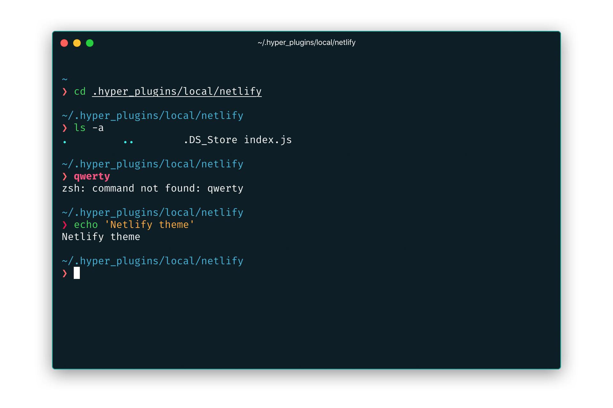

### [Hyper](https://hyper.is/)



#### Install instructions

1.  Create a new folder in `~/.hyper_plugins/local/` called `netlify`
2.  Copy `index.js` from this repo into `~/.hyper_plugins/local/netlify`
3.  Add `netlify` to the local plugins list in your `~/.hyper.js` config file:
    ```
    localPlugins: [
      'netlify'
    ]
    ```
4.  Start Hyper
5.  Go to `View -> Full Reload` or press `Cmd + Shift + R`
