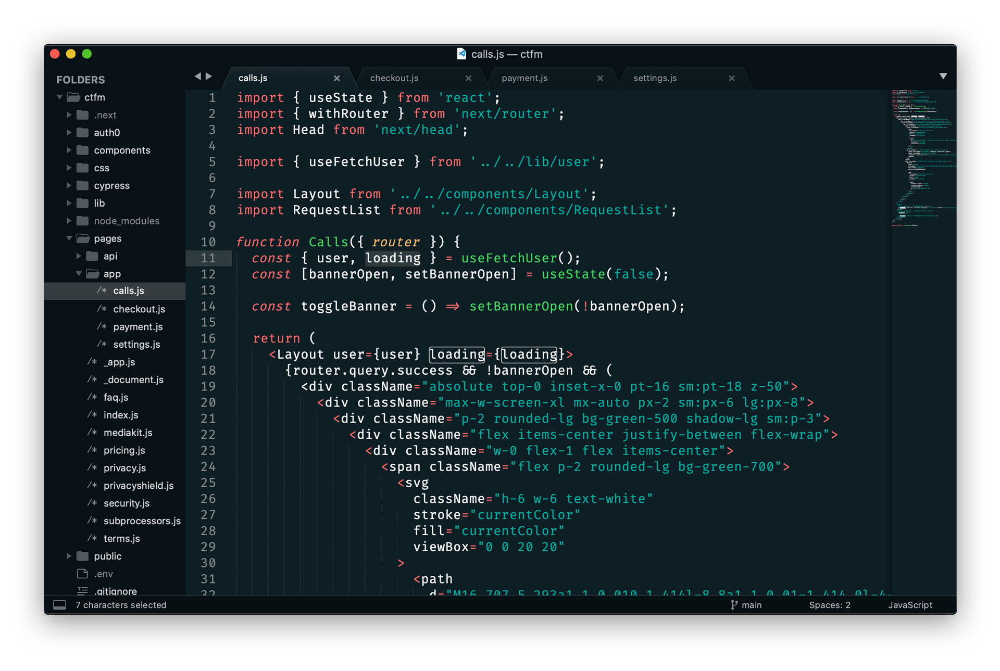

### [Sublime Text](https://sublimetext.com/)



#### Install instructions

##### Using curl

1. Locate your Sublime Text `Packages` directory by using the menu item `Preferences -> Browse Packages` in Sublime.
2. Open your terminal and enter the following command to download the theme file into a new theme folder (replacing `PACKAGES_DIRECTORY` with the directory found in step 1):
   ```sh
   cd PACKAGES_DIRECTORY/User && mkdir Netlify && cd Netlify
   curl https://github.com/ohheyjosh/netlify-theme/main/sublime-text/Netlify.tmTheme -o Netlify.tmTheme
   ```
3. Open the Command Palette in Sublime, enter `UI: Select Color Scheme` and select `Netlify`.

#### Using wget

1. Locate your Sublime Text `Packages` directory by using the menu item `Preferences -> Browse Packages` in Sublime.
2. Open your terminal and enter the following command to download the theme file into a new theme folder (replacing `PACKAGES_DIRECTORY` with the directory found in step 1):
   ```sh
   cd PACKAGES_DIRECTORY/User && mkdir Netlify && cd Netlify
   wget https://github.com/ohheyjosh/netlify-theme/main/sublime-text/Netlify.tmTheme
   ```
3. Open the Command Palette in Sublime, enter `UI: Select Color Scheme` and select `Netlify`.

#### Manually

1. Download this repository using the [GitHub .zip download](https://github.com/ohheyjosh/netlify-theme/archive/main.zip) option.
2. Unzip the files and open the "sublime-text" folder.
3. Locate your Sublime Text `Packages` directory by using the menu item `Preferences -> Browse Packages` in Sublime.
4. Navigate to your `Packages` directory and make a new folder in the "User" folder named "Netlify".
5. Copy the contents of the "sublime-text" folder to the new "Netlify" package folder.
6. Open the Command Palette in Sublime, enter `UI: Select Color Scheme` and select `Netlify`.
