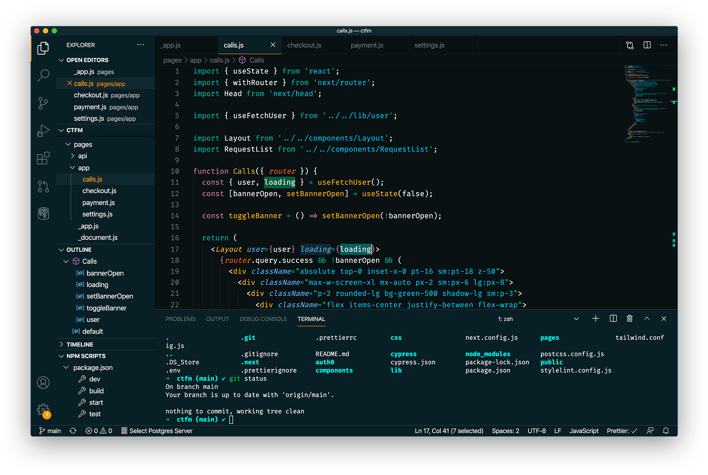

### [VS Code](http://code.visualstudio.com/)

#### Install instructions

1.  Go to `View -> Command Palette` or press `Cmd + Shift + P`
2.  Enter `Install Extensions`
3.  Write `netlify-vscode-theme`
4.  Select it or press Enter to install
5.  Activate by selecting the theme from `Preferences -> Color Theme`
