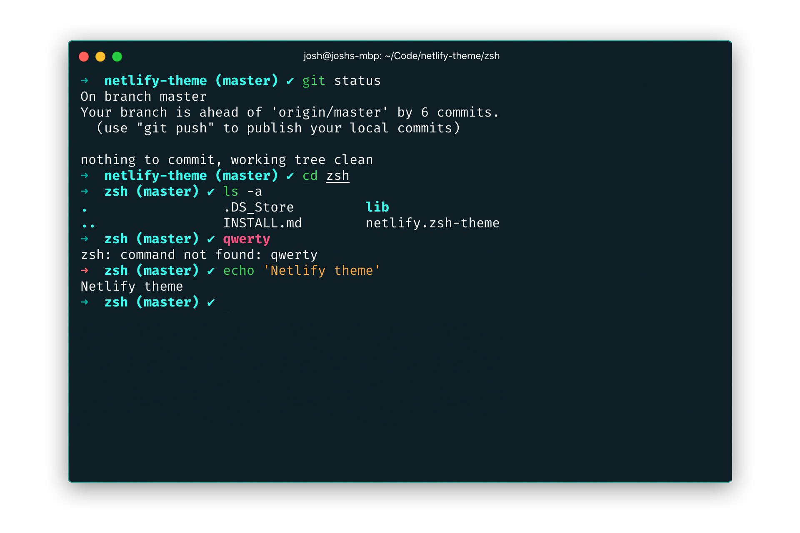

### [Zsh](https://zsh.org/)

#### Install instructions

1.  Install [oh-my-zsh](https://github.com/robbyrussell/oh-my-zsh/) if you don't have it already.
2.  Copy `netlify.zsh-theme` and `/lib/` from this repo into `~/.oh-my-zsh/themes/`
3.  Go to your `~/.zshrc` file and set `ZSH_THEME="netlify"`
